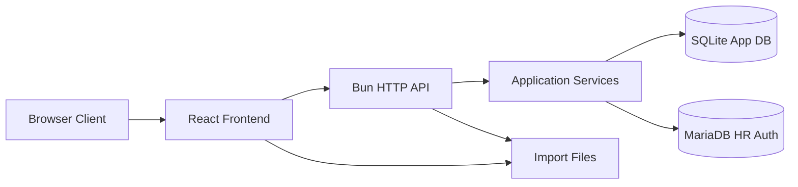

# KPI Dashboard v2 Architecture

**Status**: Draft for redesign  
**Date**: 2026-05-28  
**Owner**: Product + Engineering  
**Supersedes**: `PRD_POC_1.5.md`, `Core_SRS_v1.md`, `Core_SDS_v1.md` as the primary direction for the next-generation rewrite

---

## 1. Executive Summary

เอกสารนี้กำหนดทิศทางการ re-code ระบบ KPI Dashboard ใหม่ โดยใช้แนวคิด:

- **Simplify Product**
- **Hybrid Config Data Model**
- **Worklist First UX**
- **Bun + Node.js runtime**
- **SQLite for application data**
- **MariaDB as the existing authentication source**

เป้าหมายไม่ใช่การย้ายจาก PostgreSQL ไป SQLite อย่างเดียว แต่เป็นการแก้ปัญหาเชิงสถาปัตยกรรม, product model, และ UX/UI ที่สะสมอยู่ในระบบเดิม เพื่อให้ได้ระบบที่:

- ดูแลง่าย
- พัฒนา feature ต่อได้
- ใช้งานง่ายสำหรับเจ้าหน้าที่
- ขยายได้แบบมีวินัย

---

## 2. Problem Statement

จากการทบทวนเอกสารและโค้ดเดิม พบปัญหาหลักดังนี้:

### 2.1 Product Drift

- เอกสาร PRD, SRS, SDS, handover และโค้ดจริงไม่ตรงกันในหลายเรื่อง
- บาง feature ถูกระบุว่าเสร็จแล้ว แต่ implementation ยังไม่สมบูรณ์
- มีแนวโน้มออกแบบเผื่ออนาคตมากเกินไปตั้งแต่ระยะแรก

### 2.2 Over-Engineering

- ระบบเดิมพยายามเป็นทั้ง dashboard, data entry tool, schema builder, import engine, admin console ในคราวเดียว
- การใช้ dynamic schema หนักเกินความจำเป็น ทำให้ UI และ business logic ซับซ้อน
- backend รวม routing, validation, policy, and orchestration ไว้ในจุดเดียวมากเกินไป

### 2.3 UX Misalignment

- UX ถูกขับโดยโครงสร้างข้อมูล ไม่ใช่โดยงานที่ผู้ใช้ต้องทำ
- ผู้ใช้ operational ไม่ได้เริ่มจาก "งานที่ต้องอัปเดต" แต่เริ่มจากโครงสร้างเมนู
- admin experience และ end-user experience ยังปะปนกัน

### 2.4 Infrastructure Mismatch

- PostgreSQL ถูกใช้กับ workload ที่ยังไม่ใหญ่และยังไม่ซับซ้อนเชิง relational มากพอ
- โครงสร้างข้อมูลจริงเหมาะกับ embedded relational store ที่ดูแลง่ายกว่า

---

## 3. Product Vision for v2

### 3.1 Product Goal

สร้างระบบ KPI Dashboard สำหรับหน่วยงานสาธารณสุขที่เน้น:

- การอัปเดตข้อมูล KPI ได้ง่าย
- การติดตามงานค้างได้ชัด
- การจัดการโครงสร้าง KPI ได้โดย admin แบบปลอดภัย
- การดูภาพรวมผลการดำเนินงานได้รวดเร็ว

### 3.2 Design Principles

1. **Operational First**
   ระบบต้องช่วยให้เจ้าหน้าที่อัปเดตข้อมูลได้เร็ว ไม่ใช่ทำให้ต้องเรียนรู้โครงสร้างระบบมาก

2. **Simple by Default**
   ทุกส่วนเริ่มจากแบบง่ายก่อน ถ้าจำเป็นจึงเพิ่มความยืดหยุ่น

3. **Configuration with Guardrails**
   ระบบควรยืดหยุ่นได้ แต่ไม่เปิดอิสระจนทำให้ UX และ data quality พัง

4. **Explicit Boundaries**
   แยก frontend, application logic, persistence, auth integration, import pipeline ออกจากกันชัดเจน

5. **Local Maintainability**
   ทีมภายในต้องดูแลได้จริงโดยไม่ต้องพึ่ง infra ซับซ้อน

---

## 4. Scope of v2

### 4.1 In Scope

- Login ผ่าน MariaDB เดิม
- Session-based authentication
- Role and permission management ใน application DB
- Navigation 3 ระดับ
- KPI definition management แบบ template-driven
- KPI data entry/update
- Worklist and dashboard views
- Import wizard สำหรับ CSV/XLSX
- Audit event logging
- Admin configuration screens
- SQLite-based application data

### 4.2 Out of Scope for Initial v2

- Full no-code schema builder
- Arbitrary user-defined dynamic columns แบบไม่จำกัด
- Real-time collaboration
- Complex workflow approvals หลายขั้น
- Multi-tenant architecture
- Distributed deployment complexity

---

## 5. Target Users

### 5.1 Operational Staff

- อัปเดต KPI รายเดือน/รายงวด
- ต้องการหน้าจอที่ตรงไปตรงมา
- สนใจงานค้าง, due date, status มากกว่า metadata

### 5.2 Supervisors / Managers

- ดูภาพรวมความก้าวหน้า
- drill down เข้า KPI ที่มีความเสี่ยง
- ต้องการ dashboard และ summary ที่อ่านง่าย

### 5.3 Administrators

- จัดการโครงสร้าง navigation
- จัดการ KPI pages และ KPI definitions
- นำเข้าข้อมูล
- กำหนดสิทธิ์การใช้งาน

---

## 6. UX/UI Direction

### 6.1 Primary UX: Worklist First

หลัง login ผู้ใช้ควรเจอ:

- KPI ที่ต้องอัปเดตในรอบปัจจุบัน
- KPI ที่ค้างอัปเดต
- KPI ที่เพิ่งแก้ไขล่าสุด
- KPI ที่มีสถานะเสี่ยงหรือข้อมูลไม่ครบ

### 6.2 Secondary UX: Dashboard

dashboard เป็นหน้าเสริมสำหรับ:

- ภาพรวมตาม workgroup
- completion rates
- overdue items
- trend summaries

### 6.3 Admin UX

admin area ต้องถูกแยกจากพื้นที่ใช้งานประจำอย่างชัดเจน:

- Navigation management
- KPI definition management
- Import center
- User access management
- Audit log viewer

### 6.4 UX Rules

- ไม่ให้ user ต้องเข้าใจ schema ก่อนใช้งาน
- ใช้ภาษาที่เป็นงานจริง ไม่ใช้ศัพท์เทคนิคมากเกินไป
- ฟอร์มและตารางควรมีรูปแบบสม่ำเสมอ
- คำสั่งสำคัญต้องเห็นง่าย
- validation ต้องอธิบายได้ว่าผิดอะไรและแก้อย่างไร

---

## 7. High-Level Architecture



### 7.1 Frontend

- React + Vite
- Route-based app shell
- Feature-oriented modules
- Server-state driven UI
- Clear separation between operational UI and admin UI

### 7.2 Backend

- Bun runtime
- TypeScript
- Layered modular backend
- SQLite for app persistence
- MariaDB integration only for authentication and personnel lookup

### 7.3 Databases

- **SQLite**: single source of truth for application state
- **MariaDB**: external identity source only

---

## 8. Recommended Backend Structure

```text
backend/
  src/
    app/
      server.ts
      routes/
      middleware/
      errors/
    modules/
      auth/
      users/
      navigation/
      kpi-definitions/
      kpi-entries/
      dashboard/
      imports/
      audit/
    domain/
      shared/
      types/
      policies/
    infrastructure/
      sqlite/
      mariadb/
      logging/
      session/
    scripts/
```

### 8.1 Layer Responsibilities

- `routes`: request parsing, auth enforcement, response mapping
- `modules/*/service.ts`: business use cases
- `modules/*/repository.ts`: persistence queries
- `domain`: pure rules, policies, types
- `infrastructure`: DB clients, adapters, session store, logger

### 8.2 Why This Structure

- ลด coupling ระหว่าง route กับ database query
- แยก policy logic ออกจาก transport layer
- ทดสอบ business logic ได้ง่าย
- สามารถย้ายจาก SQLite ไป DB อื่นภายหลังโดยกระทบจำกัด

---

## 9. Recommended Frontend Structure

```text
src/
  app/
    router/
    providers/
    layouts/
  features/
    auth/
    worklist/
    dashboard/
    navigation/
    kpi/
    imports/
    admin/
  shared/
    components/
    forms/
    tables/
    hooks/
    styles/
    utils/
  config/
```

### 9.1 Frontend Principles

- ไม่ใช้ `App.jsx` เป็น state container หลักอีกต่อไป
- แยก features ตามงานผู้ใช้
- แยก reusable table/form primitives ไว้ใน `shared`
- ใช้ route-level loading and error handling
- ใช้ permission gates แบบ declarative

---

## 10. Core Domain Model

แนวทาง v2 ใช้ **Hybrid Config**:

- navigation และ page composition ขับด้วยข้อมูล
- KPI definitions ใช้ template/preset เป็นหลัก
- อนุญาตความยืดหยุ่นเฉพาะจุดที่ควบคุมได้

### 10.1 Core Entities

- `User`
- `Role`
- `Permission`
- `Session`
- `Workgroup`
- `Section`
- `KPIPage`
- `KPIDefinition`
- `KPIFieldPreset`
- `ReportingPeriod`
- `KPIEntry`
- `EntryValue`
- `ImportJob`
- `AuditEvent`

### 10.2 Navigation Model

สามระดับ:

1. `Workgroup`
2. `Section`
3. `KPIPage`

โดยแต่ละ `KPIPage` จะผูกกับชุด `KPIDefinition` ที่จะแสดงและแก้ไขได้

### 10.3 KPI Model

แทนการให้ admin สร้างคอลัมน์แบบอิสระทั้งหมด:

- ใช้ field presets เช่น:
  - numeric target/actual
  - percentage
  - milestone
  - note
  - owner
  - due date
  - status

- KPI 1 ตัวมี metadata มาตรฐาน
- ค่าในแต่ละงวดเก็บเป็น entry/value

---

## 11. SQLite Schema Draft

ตัวอย่าง schema ระดับ conceptual:

```sql
CREATE TABLE users (
  id TEXT PRIMARY KEY,
  username TEXT NOT NULL UNIQUE,
  full_name TEXT,
  role_code TEXT NOT NULL,
  is_active INTEGER NOT NULL DEFAULT 1,
  last_login_at TEXT,
  created_at TEXT NOT NULL,
  updated_at TEXT NOT NULL
);

CREATE TABLE roles (
  code TEXT PRIMARY KEY,
  name TEXT NOT NULL
);

CREATE TABLE permissions (
  code TEXT PRIMARY KEY,
  name TEXT NOT NULL
);

CREATE TABLE role_permissions (
  role_code TEXT NOT NULL,
  permission_code TEXT NOT NULL,
  PRIMARY KEY (role_code, permission_code)
);

CREATE TABLE sessions (
  id TEXT PRIMARY KEY,
  username TEXT NOT NULL,
  token_hash TEXT NOT NULL UNIQUE,
  expires_at TEXT NOT NULL,
  created_at TEXT NOT NULL,
  last_seen_at TEXT
);

CREATE TABLE workgroups (
  id TEXT PRIMARY KEY,
  code TEXT NOT NULL UNIQUE,
  name TEXT NOT NULL,
  sort_order INTEGER NOT NULL,
  is_active INTEGER NOT NULL DEFAULT 1
);

CREATE TABLE sections (
  id TEXT PRIMARY KEY,
  workgroup_id TEXT NOT NULL,
  code TEXT NOT NULL,
  name TEXT NOT NULL,
  sort_order INTEGER NOT NULL,
  is_active INTEGER NOT NULL DEFAULT 1,
  UNIQUE (workgroup_id, code)
);

CREATE TABLE kpi_pages (
  id TEXT PRIMARY KEY,
  section_id TEXT NOT NULL,
  code TEXT NOT NULL,
  name TEXT NOT NULL,
  description TEXT,
  sort_order INTEGER NOT NULL,
  is_active INTEGER NOT NULL DEFAULT 1,
  UNIQUE (section_id, code)
);

CREATE TABLE kpi_definitions (
  id TEXT PRIMARY KEY,
  kpi_page_id TEXT NOT NULL,
  code TEXT NOT NULL,
  name TEXT NOT NULL,
  unit TEXT,
  value_type TEXT NOT NULL,
  preset_code TEXT NOT NULL,
  owner_label TEXT,
  sort_order INTEGER NOT NULL,
  is_active INTEGER NOT NULL DEFAULT 1,
  UNIQUE (kpi_page_id, code)
);

CREATE TABLE reporting_periods (
  id TEXT PRIMARY KEY,
  period_key TEXT NOT NULL UNIQUE,
  period_type TEXT NOT NULL,
  starts_at TEXT NOT NULL,
  ends_at TEXT NOT NULL,
  status TEXT NOT NULL
);

CREATE TABLE kpi_entries (
  id TEXT PRIMARY KEY,
  kpi_definition_id TEXT NOT NULL,
  reporting_period_id TEXT NOT NULL,
  status TEXT NOT NULL,
  assigned_to TEXT,
  due_at TEXT,
  updated_at TEXT NOT NULL,
  updated_by TEXT,
  UNIQUE (kpi_definition_id, reporting_period_id)
);

CREATE TABLE entry_values (
  id TEXT PRIMARY KEY,
  kpi_entry_id TEXT NOT NULL,
  target_value TEXT,
  actual_value TEXT,
  progress_value REAL,
  note TEXT,
  extra_json TEXT
);

CREATE TABLE import_jobs (
  id TEXT PRIMARY KEY,
  source_filename TEXT NOT NULL,
  status TEXT NOT NULL,
  created_by TEXT NOT NULL,
  created_at TEXT NOT NULL,
  summary_json TEXT
);

CREATE TABLE audit_events (
  id TEXT PRIMARY KEY,
  entity_type TEXT NOT NULL,
  entity_id TEXT NOT NULL,
  action TEXT NOT NULL,
  actor_username TEXT,
  occurred_at TEXT NOT NULL,
  payload_json TEXT
);
```

### 11.1 Notes on SQLite Design

- ใช้ `TEXT` IDs เพื่อสะดวกต่อ UUID/ULID
- เก็บวันที่เป็น ISO-8601 string
- ใช้ `extra_json` เฉพาะจุด ไม่ใช้แทน relational model ทั้งหมด
- บังคับ uniqueness ในระดับที่จำเป็น

---

## 12. Authentication and Authorization Design

### 12.1 Authentication Flow

1. User ส่ง username/password
2. Backend ตรวจข้อมูลกับ MariaDB `personnel`
3. ถ้าถูกต้อง ระบบ sync user profile เข้าสู่ SQLite
4. ระบบสร้าง session token
5. เก็บเฉพาะ `token_hash` ใน SQLite
6. client ใช้ session cookie หรือ bearer token

### 12.2 Why Keep MariaDB for Auth

- เป็น source of truth เดิมขององค์กร
- ลดผลกระทบต่อ credential governance
- ไม่ต้อง duplicate password storage ใน app DB

### 12.3 Authorization Flow

- แอปใช้ role + permission จาก SQLite
- MariaDB ไม่รับผิดชอบเรื่อง authorization
- permissions ต้องชัด, stable, และ seed ได้จาก migration

### 12.4 Recommended Roles

- `admin`
- `manager`
- `editor`
- `viewer`

### 12.5 Permission Examples

- `worklist.read`
- `kpi.read`
- `kpi.update`
- `kpi.import`
- `dashboard.read`
- `admin.navigation`
- `admin.kpi_definition`
- `admin.users`
- `audit.read`

---

## 13. API Design Direction

### 13.1 API Style

- RESTful JSON APIs
- stable resource naming
- consistent error envelope
- explicit validation errors

### 13.2 Recommended Resource Groups

- `/api/auth/*`
- `/api/me/*`
- `/api/worklist/*`
- `/api/navigation/*`
- `/api/kpi-pages/*`
- `/api/kpi-definitions/*`
- `/api/kpi-entries/*`
- `/api/dashboard/*`
- `/api/imports/*`
- `/api/admin/*`
- `/api/audit/*`

### 13.3 Example Endpoints

```text
POST   /api/auth/login
POST   /api/auth/logout
GET    /api/me

GET    /api/worklist
GET    /api/navigation

GET    /api/kpi-pages/:pageId
GET    /api/kpi-pages/:pageId/entries?period=2026-05

PATCH  /api/kpi-entries/:entryId
POST   /api/imports
POST   /api/imports/:jobId/commit

GET    /api/admin/navigation
POST   /api/admin/navigation/pages
PUT    /api/admin/kpi-definitions/:id
GET    /api/audit/events
```

---

## 14. Worklist-First UX Model

### 14.1 Home Screen

แสดง:

- KPI ที่ยังไม่อัปเดตในงวดนี้
- KPI ที่เกินกำหนด
- KPI ที่ assigned ให้ user ปัจจุบัน
- shortcuts ไปยัง page ที่ใช้บ่อย

### 14.2 KPI Page Screen

แบ่งเป็น:

- page header
- current period selector
- KPI cards/table
- inline update หรือ side panel editor
- change history

### 14.3 Admin Screen

แยกเป็นโมดูล:

- Navigation
- KPI Definitions
- Imports
- Users & Roles
- Audit

---

## 15. Import Architecture

### 15.1 Import Workflow

1. Upload file
2. Parse and detect headers
3. Map columns to known fields
4. Preview records and validation issues
5. Commit import
6. Create audit event and import summary

### 15.2 Why Wizard-Based Import

- ลดความผิดพลาด
- ทำให้ผู้ใช้เข้าใจผลก่อน commit
- รองรับ rollback ทางธุรกิจได้ง่ายกว่า

### 15.3 Supported Formats

- CSV
- XLSX

JSON import ไม่ควรเป็น priority แรกใน UI ยกเว้นใช้สำหรับ system-to-system tools

---

## 16. Audit and Observability

### 16.1 Audit Model

ไม่พึ่ง DB triggers เป็นหลักเหมือนเดิม แต่ให้ service layer บันทึก `audit_events` อย่างชัดเจนเมื่อเกิด business action:

- login success/failure
- entry update
- import commit
- navigation change
- definition change
- permission change

### 16.2 Why Application-Level Audit

- อ่านความหมายทางธุรกิจได้ตรงกว่า row-level DB trigger
- ทดสอบได้ง่ายกว่า
- ย้าย DB engine ได้ง่ายกว่า

### 16.3 Logging

- request log
- auth log
- import log
- error log

---

## 17. ADR Summary

### ADR-001: Use SQLite for Application Data

**Decision**: เปลี่ยน application database จาก PostgreSQL เป็น SQLite  
**Reason**:

- workload ยังไม่ใหญ่
- ลด operational overhead
- backup/restore ง่าย
- เหมาะกับ single-organization deployment

### ADR-002: Keep MariaDB as Authentication Source

**Decision**: ใช้ MariaDB เดิมสำหรับ credential verification  
**Reason**:

- ไม่กระทบระบบบุคลากรเดิม
- ลดความเสี่ยงในการย้ายรหัสผ่าน

### ADR-003: Adopt Hybrid Config Instead of Fully Dynamic Schema

**Decision**: ใช้ preset/template-driven KPI modeling  
**Reason**:

- UX ง่ายกว่า
- schema และ business rule ชัดกว่า
- ลดความเสี่ยงจาก over-generalization

### ADR-004: Use Worklist First UX

**Decision**: หน้าแรกหลัง login เป็น worklist ไม่ใช่ dashboard  
**Reason**:

- ผู้ใช้หลักคือ operational staff
- ทำให้ระบบช่วยงานจริงมากขึ้น

### ADR-005: Use Layered Modular Backend

**Decision**: แยก route, service, repository, infrastructure  
**Reason**:

- ทดสอบง่าย
- maintain ง่าย
- ขยาย feature ปลอดภัยกว่า

### ADR-006: Application-Level Audit Instead of Trigger-Heavy Design

**Decision**: ใช้ service-driven audit events  
**Reason**:

- ได้ semantic audit ที่ชัดกว่า
- ลด coupling กับ DB engine

---

## 18. Migration Strategy

### 18.1 Migration Mode

ใช้แนวทาง **Fresh Start**

- ออกแบบ SQLite schema ใหม่จาก target product model
- ไม่พยายามย้าย PostgreSQL schema เดิมแบบ 1:1
- ข้อมูลเดิมถ้าจำเป็น ค่อยทำ import tool แยก

### 18.2 Practical Migration Approach

1. Freeze feature set ของระบบเก่า
2. ออกแบบ seed/master data format ใหม่
3. สร้าง data extraction script จาก PostgreSQL เดิม
4. map เข้าสู่ SQLite schema ใหม่
5. validate ด้วย sample KPI pages

---

## 19. Non-Functional Targets

### 19.1 Performance

- page load under 2 seconds on local network
- common API under 300 ms
- import preview under 5 seconds for normal office files

### 19.2 Reliability

- graceful error states
- recoverable import failures
- deterministic migrations

### 19.3 Security

- no plaintext token storage in DB
- httpOnly cookie support
- input validation on every mutation
- role/permission checks centralized

### 19.4 Maintainability

- feature-based modules
- typed DTOs and domain models
- migrations under version control
- automated tests for core business flows

---

## 20. Recommended Next Deliverables

หลังเอกสารนี้ ควรทำต่อเป็นลำดับดังนี้:

1. `Implementation Roadmap v2`
2. `SQLite schema migration spec`
3. `API contract v2`
4. `Frontend IA and screen map`
5. `Auth integration spec with MariaDB`
6. `Seed data and local development bootstrap`

---

## 21. Final Recommendation

สำหรับโปรเจ็กต์นี้ แนวทางที่เหมาะสมที่สุดคือ:

- re-code ใหม่บน architecture ที่เรียบกว่าเดิม
- ใช้ SQLite เป็น app DB
- คง MariaDB สำหรับ auth
- ลด dynamic schema แบบสุดทาง
- เปลี่ยน UX ให้เริ่มจากงานของผู้ใช้
- แยก admin จาก operational workflow

แนวทางนี้จะทำให้ v2 เป็นระบบที่ "สร้างเสร็จแล้วดูแลต่อได้จริง" มากกว่าระบบที่ยืดหยุ่นสูงแต่เปราะและซับซ้อน

